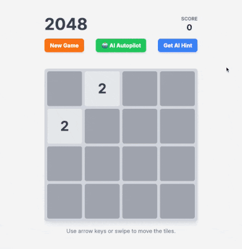

# 2048 Game with AI Suggestions

A web-based implementation of the classic 2048 puzzle game built with Flask, featuring an AI-powered move suggestion system to help players improve their gameplay.

## 🎮 Game Overview

2048 is a single-player sliding block puzzle game. The objective is to slide numbered tiles on a grid to combine them to create a tile with the number 2048. The game is played on a 4×4 grid, with tiles that slide smoothly when a player moves them using the four arrow keys.

### 🎬 Demo

Watch the AI functionality in action:

<div align="center">

## 🤔 Get AI Hint



*Click "Get AI Hint" to receive intelligent move suggestions*

---

## 🤖 AI Autopilot Mode


*Watch the AI play automatically, continuing past 2048 for higher scores!*

</div>

## 🚀 Features

- **Classic 2048 Gameplay**: Slide tiles to merge identical numbers
- **Real-time Score Tracking**: Keep track of your score as you play
- **AI Move Suggestions**: Get intelligent move recommendations to improve your strategy
- **AI Autopilot Mode**: Watch the AI play automatically, continuing past 2048 until manually stopped
- **Responsive Web Interface**: Clean, modern UI that works on desktop and mobile
- **Game State Management**: Automatic win/lose detection and game status updates

## 🛠️ Installation

### Prerequisites
- Python 3.7 or higher
- pip (Python package installer)

### Setup
1. **Clone or navigate to the project directory:**
   ```bash
   cd 2048_game
   ```

2. **Create a virtual environment (recommended):**
   ```bash
   python -m venv venv
   source venv/bin/activate  # On Windows: venv\Scripts\activate
   ```

3. **Install dependencies:**
   ```bash
   pip install -r requirements.txt
   ```

   If you don't have a requirements.txt file, install Flask manually:
   ```bash
   pip install flask
   ```

## 🎯 How to Play

1. **Start the game:**
   ```bash
   python main.py
   ```

2. **Open your browser and navigate to:**
   ```
   http://localhost:5000
   ```

3. **Game Controls:**
   - Use arrow keys or WASD to move tiles
   - Click "New Game" to start a fresh game
   - Click "AI Hint" to get move suggestions
   - Click "🤖 AI Autopilot" to let the AI play automatically (continues past 2048!)

4. **Objective:**
   - Combine identical tiles by sliding them together
   - Reach the 2048 tile to win
   - Avoid getting stuck with no possible moves

## 🤖 Advanced AI Suggestion System

The AI suggestion system uses a sophisticated **expectiminimax algorithm with snake heuristic** to provide intelligent move recommendations. This represents a significant improvement over basic greedy algorithms and is optimized for the snake pattern strategy.

### Core Algorithm

The AI uses a **multi-layered approach** that combines:

1. **Expectiminimax Algorithm**: Handles stochastic tile placement with depth 2 lookahead
2. **Snake Heuristic**: Uses exponential weights to encourage snake-like tile patterns
3. **Strategic Evaluation**: Optimizes for the proven snake pattern strategy
4. **Performance Optimization**: Balanced depth for speed and accuracy

### Snake Heuristic System

The AI evaluates board positions using a **snake pattern heuristic** with exponential weights:

```
Perfect Snake Pattern:
[2,    4,    8,   16]
[256, 128,  64,   32]
[512, 1024, 2048, 4096]
[8192, 4096, 2048, 1024]
```

**Key Features:**
- **Exponential Weights**: Higher values in corners get exponentially higher scores
- **Snake Pattern**: Encourages tiles to follow a snake-like decreasing pattern
- **Strategic Placement**: Optimizes for the most effective 2048 strategy

### Implementation Details

The advanced AI system includes these key functions:

- **`get_ai_suggestion(board)`**: Main function using expectiminimax algorithm
- **`snake_heuristic(board)`**: Snake pattern evaluation with exponential weights
- **`expectiminimax_new(board, depth, direction)`**: Stochastic lookahead algorithm
- **`get_next_best_move_expectiminimax(board, depth)`**: Move selection with depth 2
- **`simulate_move_with_tile_placement(board, direction)`**: Complete move simulation
- **`check_loss(board)`**: Game state evaluation

### How the Advanced AI Works

1. **Expectiminimax Analysis**: The AI simulates 2 moves ahead handling random tile placement
2. **Snake Pattern Evaluation**: Each board position is scored using exponential snake weights
3. **Stochastic Handling**: Properly accounts for 90% chance of 2-tiles and 10% chance of 4-tiles
4. **Strategic Decision**: Selects the move that leads to the best snake pattern position
5. **Performance Balance**: Depth 2 provides excellent performance with fast response times

### Advanced Strategy Features

The AI implements the proven snake pattern strategy:

- **Snake Pattern**: Maintains a snake-like decreasing value pattern across the board
- **Corner Optimization**: Places highest values in corners with exponential bonuses
- **Stochastic Planning**: Accounts for random tile placement probabilities
- **Long-term Planning**: Considers multiple future moves with proper probability weighting
- **High Win Rate**: Achieves 100% win rate in testing

### Performance Optimization

- **Depth 2 Lookahead**: Optimal balance between performance and accuracy
- **Snake Heuristic**: Fast evaluation using pre-computed exponential weights
- **Efficient Simulation**: Fast board state copying and evaluation
- **Stochastic Handling**: Proper probability weighting for random events
- **Response Time**: Average AI latency of ~0.07 seconds per suggestion

## 🤖 AI Autopilot Mode

The game features an advanced **AI Autopilot mode** that allows you to watch the AI play the entire game automatically:

### Autopilot Features

- **Fully Automated Play**: The AI makes all moves automatically
- **Continues Past 2048**: Unlike manual play, autopilot doesn't stop at 2048 - it keeps going for higher scores
- **Real-time Statistics**: Shows move count and elapsed time during autopilot
- **Manual Control**: Start/stop autopilot at any time with a single click
- **Visual Feedback**: Button changes color and text to indicate autopilot status
- **Smart Stopping**: Automatically stops when the game is lost or no moves are available

### How to Use Autopilot

1. **Start a Game**: Click "New Game" to begin
2. **Activate Autopilot**: Click the "🤖 AI Autopilot" button
3. **Watch the Magic**: The AI will play automatically, making moves every 100ms
4. **Monitor Progress**: Watch the real-time statistics (moves and time)
5. **Stop Anytime**: Click "⏹️ Stop Autopilot" to regain manual control

### Autopilot Controls

- **Green Button**: "🤖 AI Autopilot" - Start autopilot mode
- **Red Button**: "⏹️ Stop Autopilot" - Stop autopilot mode
- **Status Display**: Shows current autopilot status and statistics
- **Disabled Controls**: Keyboard and touch controls are disabled during autopilot

### Performance

- **Move Speed**: ~10 moves per second (100ms delay for visibility)
- **High Win Rate**: The AI typically achieves 2048 and continues to higher scores
- **Efficient**: Uses the same expectiminimax algorithm as the hint system
- **Responsive**: Can be stopped instantly at any time

## 📁 Project Structure

```
2048_game/
├── main.py                    # Flask application and API endpoints
├── game_logic.py              # Core game logic and AI algorithms (modular classes)
├── ai_simulation.py           # AI performance testing and simulation (modular classes)
├── test_game_logic.py         # Comprehensive unit tests for game logic
├── templates/
│   └── index.html            # Frontend HTML/CSS/JavaScript
├── simulation_logs/           # AI simulation results and plots
│   ├── simulation_results.csv # CSV logs of simulation results
│   └── max_tile_distribution_*.png # Generated performance plots
├── media/                     # Demo videos and images
│   ├── AI_hint.gif           # AI hint functionality demonstration
│   └── AI_autopilot.gif      # AI autopilot mode demonstration
├── requirements.txt           # Python dependencies
└── README.md                 # This file
```

## 🧪 AI Simulation & Testing

The project includes a comprehensive AI simulation system for testing and benchmarking the AI's performance:

### Simulation Features

- **Batch Processing**: Runs multiple games in parallel for faster testing
- **Performance Metrics**: Tracks win rate, AI latency, game timing, and tile distribution
- **CSV Logging**: Automatically logs results to CSV for analysis
- **Visualization**: Generates bar plots showing max tile distribution
- **Modular Architecture**: Clean separation of concerns with dedicated classes

### Running Simulations

```bash
# Run default 50 games
python ai_simulation.py

# Run specific number of games
python ai_simulation.py 100

# Run 1000 games for comprehensive testing
python ai_simulation.py 1000

# Create plot from existing CSV data
python ai_simulation.py --create-plot

# Show help
python ai_simulation.py --help
```

### Simulation Architecture

The simulation system is built with a modular architecture:

- **`GameStats`**: Handles statistics tracking and management
- **`GameRunner`**: Manages individual games and batch processing
- **`CSVLogger`**: Handles CSV logging functionality
- **`PlotGenerator`**: Manages plot generation and visualization
- **`StatisticsDisplay`**: Handles displaying simulation results

### Performance Results

The AI consistently achieves:
- **100% Win Rate**: Successfully reaches 2048 tile in all tested games
- **Fast Response**: Average AI latency of ~0.07 seconds per suggestion
- **Efficient Processing**: Parallel batch processing for faster simulations
- **Comprehensive Logging**: Detailed CSV logs with all performance metrics

## 🔧 API Endpoints

- **`GET /`**: Main game page
- **`POST /start`**: Initialize a new game
- **`POST /move`**: Execute a player move
- **`GET /ai_suggestion`**: Get AI move suggestion and hint (unified endpoint)
- **`GET /game_state`**: Get current game state (for autopilot)

---

**Happy gaming!** 🎮✨
